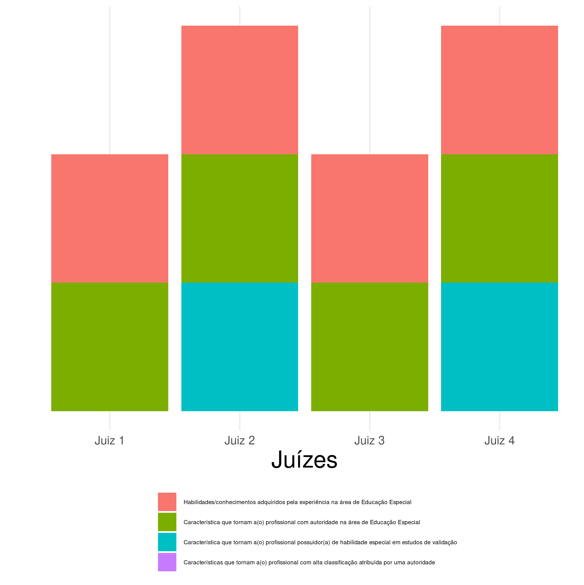
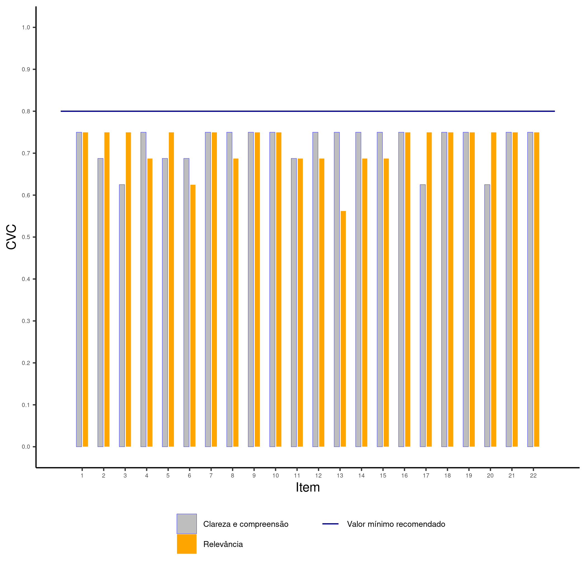
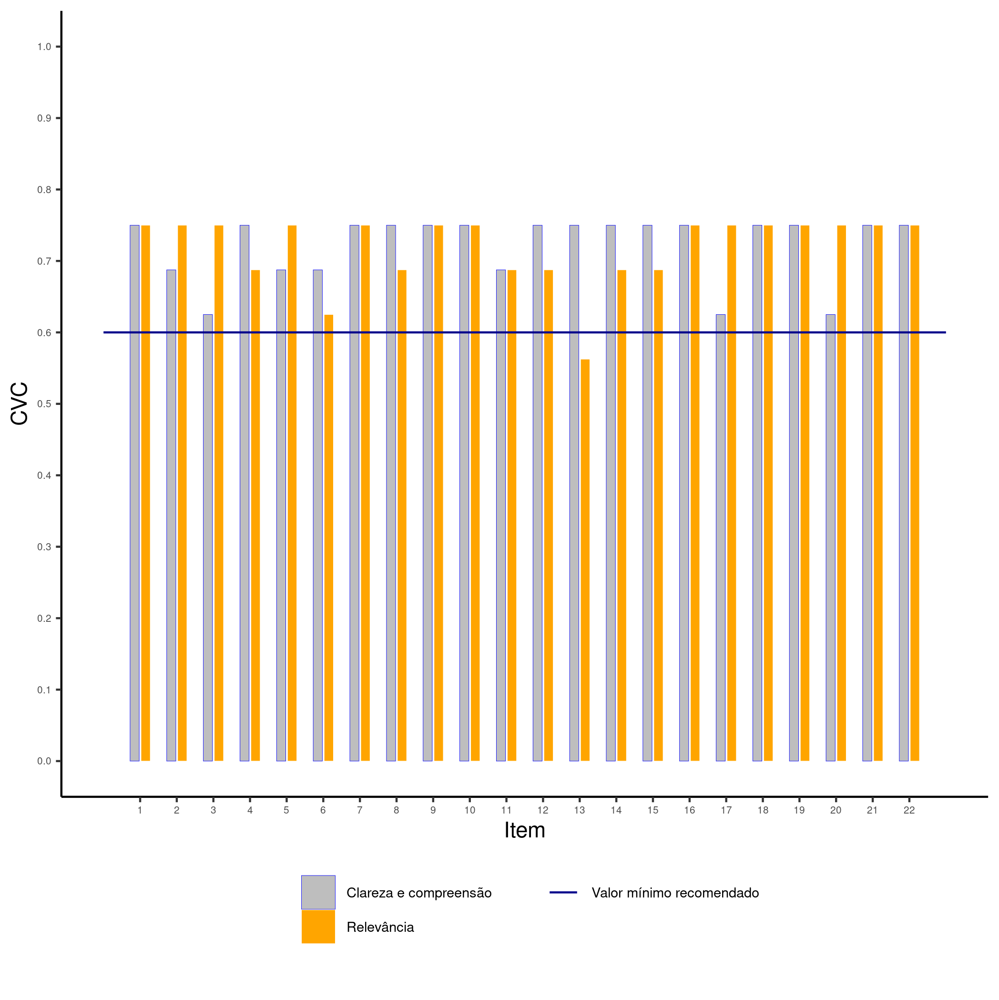
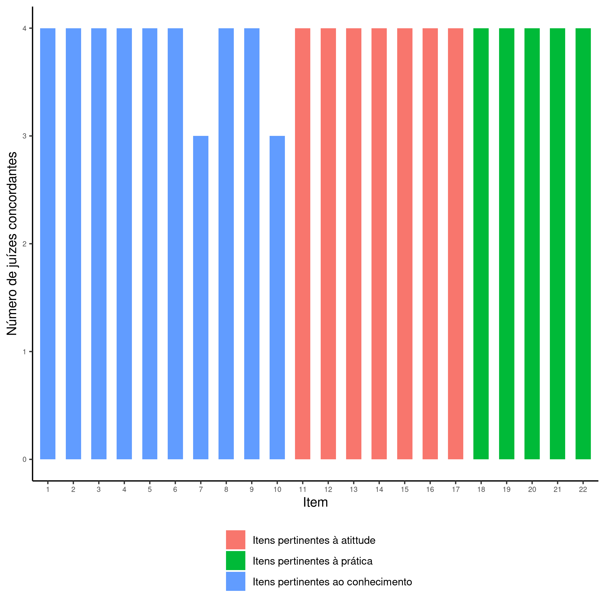

```{r setup, include=FALSE}
knitr::opts_chunk$set(echo = FALSE, cache = TRUE, fig.align = "center", out.width = "75%", fig.pos = "htbp", warning = FALSE)
library(openxlsx)
library(psych)
library(readxl)
library(tidyverse)
```

\onehalfspacing

  \begin{titlepage}
    \drop=0.1\textheight
    \centering
    \vspace*{\baselineskip}
    \rule{\textwidth}{1.6pt}\vspace*{-\baselineskip}\vspace*{2pt}
    \rule{\textwidth}{0.4pt}\\[\baselineskip]
    {\LARGE RELATÓRIO FINAL \\ 
    \vspace*{\baselineskip}
    VALIDAÇÃO DE ESCALA DE CONHECIMENTO, ATITUDES E PRÁTICAS DE PROFESSORES SOBRE O TRANSTORNO DO ESPECTRO AUTISTA -- FASE 2}\\[0.2\baselineskip]
    \rule{\textwidth}{0.4pt}\vspace*{-\baselineskip}\vspace{3.2pt}
    \rule{\textwidth}{1.6pt}\\[\baselineskip]
    \scshape
    Trabalho de consultoria realizado no contexto da ação de extensão da Universidade Federal da Bahia com título \textit{Consultoria Estatística}. \\
    \vspace*{2\baselineskip}
    Elaborado por \\[\baselineskip]
    {\Large Gilberto Pereira Sassi\par}
    \vfill
    {\scshape 2021} \\
    {\large Universidade Federal da Bahia}\\
    {\large Instituto de Matemática e Estatística}\\
    {\large Departamento de Estatística}\par
  \end{titlepage}

\newpage

\tableofcontents

\newpage

# Introdução

Este relatório apresenta os resultados da análise estatística do conjunto de dados referente à seguinte consultoria:

* **Consulente:** Danilo de Assis Pereira;
* **Título do projeto:** Validação de escala de conhecimento, atitudes e práticas de professores sobre transtorno do espectro autista -- Fase 2.

# Materiais e métodos

O consulente pediu apoio no sexto passo do polo teórico na validação de conteúdo da escala de _conhecimento, atitude e prática _ do modelo psicométrico proposto por @pasquali1999elaboraccao. Nesta consultoria, construimos três gráficos:

1. Gráfico de distribuição das características dos juízes;
1. Gráfico do Coeficiente de Validade de Conteúdo em relação à clareza/compreensão e relevância dos itens;
1. Gráfico de distribuição de concordância entre os juízes  usando o coeficiente de Kappa [@fleiss1981measurement];

e duas tabelas:

1. Tabela do perfil dos especialistas segundos os atributos conforme estabelecido por @jasper1994expert;
1. Tabela com o coeficiente kappa de Cohen [@kraemer2014kappa] para cada par de juízes.

Todas as computações e gráficos foram construídas usando a linguagem `R` [@Rlang], e as tabelas foram construídas usando o `excel`.

## Cálculo do Coeficiente de Validade de Conteúdo

Primeiramente, eu usei a seguinte codificação para calcular o Coeficiente de Validade de Conteúdo (CVC) para a análise de _clareza e compreensão_:

1. _nada claro_ corresponde ao valor 1;
2. _pouco claro_ corresponde ao valor 2;
3. _muito claro_ corresponde ao valor 3;
4. _totalmente claro_ corresponde ao valor 4;

E para a análise de _relevância_, eu usei a seguinte codificação:

1. _nada relevante_ corresponde ao valor 1;
2. _pouco relevante_ corresponde ao valor 2;
3. _muito relevante_ corresponde ao valor 3;
4. _totalmente relevante_ correspondeo ao valor 4.


Para computar o Coeficinte de Validade Conteúdo para o item em um instrumento com $I$ itens avaliado por $J$ juízes, usamos o seguinte algoritmo:

1. Calcular a nota média do item $i$: $\bar{x}_i = \frac{\sum_{j=1}^{J}x_j}{J}$;
1. Penalização de vieses dos juízes: $P_i = \frac{1}{J}$;
1. Calcular o Coeficiente de Validade do Conteúdo do $i$-ésimo item: $CVC_i = \frac{\bar{x}_i}{\max{\{x_1, \dots, x_J\}}} - P_i$;
1. Finalmente, o Coeficiente de Validade do instrumento é dado por: $CVC_t = \frac{\sum_{i=1}^{I}CVC_i}{I}$.

O instrumento do consulente tem $I = 22$ itens e foram consultados $J = 4$ juízes.

Todos os cálculos desta seção seguiram as instruções e orientações de @firmiano2017escala disponbilizadas pelo consulente.

## Condorância entre os juízes:  Cálculo do coeficiente Kappa de Cohen

Computa-se o Coeficiente Kappa de Cohen entre dois juízes através da seguinte equação
$$
\kappa = \frac{p_o - p_e}{1 - p_e},
$$
em que $p_0$ é a proporção de concordância entre os dois juízes, e $p_e$ é computado por
$$
p_e = \frac{n_{11}n_{12} + n_{21}n_{22} + n_{31}n_{32}}{I^2},
$$
em que

* $n_{11}$ é o número de vezes que o juiz 1 escolheu a categoria _Conhecimento_ e $n_{12}$ é o número de vezes que o juiz 2 escolheu a categoria _Conhecimento_;
* $n_{21}$ é o número de vezes que o juiz 1 escolheu a categoria _Atitude_ e $n_{22}$ é o número de vezes que o juiz 2 escolheu a categoria _Atitude_;
* $n_{31}$ é o número de vezes que o juiz 1 escolheu a categoria _Prática_ e $n_{32}$ é o número de vezes que o juiz 2 escolheu a categoria _Prática_;
* $I$ é a quantidade de itens no instrumento. No instrumento objeto desta consultoria temos que $I=22$.

A computação apresentada nesta seção usou as seguintes referências: @firmiano2017escala, @fmsb2021package e @irr2019package.

\newpage

# Resultados

Nesta seção, vou incluir os resulados obtidos. Além deste relatório vou enviar ao consulente os seguinte arquivos:

1. `grafico1.zip`: arquivo `.zip` com quatros figuras do _gráfico de distribuição das características dos juízes_  nos formatos `.jpeg`, `.png`, `.eps` e `.pdf`;
1. `grafico2_v1.zip`: arquivo `.zip` com quatros figuras do _gráfico do Coeficiente de Validade de Conteúdo em relação à clareza/compreensão e relevância dos itens_ nos formatos `.jpeg`, `.png`, `.eps` e `.pdf`. Neste gráfico, inclui uma linha que representa o valor $0,8$ recomendado por @firmiano2017escala para um item com _clareza e compreensão_ e _relevância_ satisfatórios (apesar do valor Máximo para o Coeficiente de Validade de Conteúdo ser no máximo $0,75$);
1. `grafico2_v2.zip`: arquivo `.zip` com quatros figuras do _gráfico do Coeficiente de Validade de Conteúdo em relação à clareza/compreensão e relevância dos itens_ nos formatos `.jpeg`, `.png`, `.eps` e `.pdf`. Neste gráfico, inclui uma linha que representa $80\%$ de $0,75$ que é $0,6$. Este valor de referência talvez faça mais sentido em um processo de validação de instrumento com quatro juízes;
1. `grafico3.zip`: arquivo `.zip` com quatros figuras do _gráfico de distribuição de concordância entre os juízes_ nos formatos `.jpeg`, `.png`, `.eps` e `.pdf`;
1. `danilo.xlsx`: arquivo `excel` com tabelas para as adaptações e formatações que o consulente julgar conveniente.

\newpage

## Gráfico de distribuição das características dos juízes

Na Figura \@ref(fig:grafico1), incluimos o perfil dos especialistas segundo os atributos definidos por @jasper1994expert. Notamos que nenhum juiz tem o atributo _características que tornam o profissional com alta classificação atribuída por uma autoridade_.

```{r grafico1, fig.cap="Gráfico de distribuição das características dos juízes.", out.width="90%"}

```

\newpage

## Gráfico do Coeficiente de Validade de Conteúdo em relação à clareza/compreensão e relevância dos itens (primeira versão)

Na Figura \@ref(fig:grafico2V1), incluimos o gráfico com o coeficiente CVC de clareza/compreensão e com o coeficiente de CVC de relevância para cada item. Além disso, incluímos o valor de referência recomendando por @hernandez2002contributions que é $0,8$. Como a amostra tem quatro juízes, o valor máximo do coeficiente CVC é $1-\frac{1}{4}=0,75$ para esta amostra, abaixo do valor recomendado por @hernandez2002contributions, e, por isso, a linha azul que representa o _valor mínimo de $CVC_i$ para um item ter conteúdo válido_ está acima de todas as barras na Figura \@ref(fig:grafico2V1).

```{r grafico2V1, fig.cap="Gráfico de distribuição das características dos juízes.", out.width="90%"}

```

\newpage

## Gráfico do Coeficiente de Validade de Conteúdo em relação à clareza/compreensão e relevância dos itens (segunda versão)

Na Figura \@ref(fig:grafico2V2), incluimos o gráfico com o coeficiente CVC de clareza/compreensão e com o coeficiente de CVC de relevância para cada item. Além disso, incluímos o valor de referência $0,6$. Como a amostra tem quatro juízes, o valor máximo do coeficiente CVC é $1-\frac{1}{4}=0,75$ para esta amostra de juízes, e o consulente poderia usar $80\%$ do valor máximo $0,75$ que é $0,6$.

```{r grafico2V2, fig.cap="Gráfico de distribuição das características dos juízes.", out.width="90%"}

```

\newpage

## Gráfico de distribuição de concordância entre os juízes

Na Figura \@ref(fig:grafico3), mostramos o gráfico de concordância entre os juízes sobre os construtos (Conhecimento, Atitude e Prática) de cada item. Os juízes apresentam uma alta concordância sobre os construtos (Conhecimento, Atitude e Prática) avaliados em cada item.

Para construir este gráfico, chequei se a resposta sobre o construto do item do juiz é igual ao construto do item pensado pelo consulente, e assumi que

1. Questões 1 a 10 estão relacionadas ao construto _Conhecimento_ (segundo o consulente);
2. Questões 11 a 17 estão relacionadas ao construto _Atitude_ (segundo o consulente);
3. Questões 18 a 22 estão relacionadas ao construto _Prática_ (segundo o consulente).

O consulente não forneceu essas informações, e eu as inferi. Sugiro que o consulente confira e confirme estas informações.

```{r grafico3, fig.cap="Número de juízes concordantes."}

```

\newpage

## Tabela do perfil dos especialistas segundos os atributos

Na Tabela \@ref(tab:atributo), mostramos que as características dos juízes selecionados se distribuem de forma representativa nos atributos, com exceção ao atributo _homenagem/menção honrosa de reconhecimento como autoridade na área de Educação Especial e/ou Transtorno do Espectro Autista, recebida de instituição científica_.

\begin{table}[htbp]
\caption{Atributo / característica profissional.}
\label{tab:atributo}
\scalebox{0.65}{
\begin{tabular}{|l|r|}
\hline
\textbf{Habilidades/conhecimentos adquirido pela experiência na área de Educação Especial} & \multicolumn{1}{l|}{\textbf{}} \\ \hline
Tempo mínimo de 5 anos de experiência profissional assistencial na área de Educação Especial & 4 \\ \hline
Tempo mínimo de 5 anos de experiência docente na área de Educação Especial & 0 \\ \hline
\textbf{Característica que tornam a (o) profissional autoridade  na área de Educação Especial} & \multicolumn{1}{l|}{\textbf{}} \\ \hline
Convidado em evento científico nacional ou internacional na área de Educação Especial e/ou
Transtorno do Espectro Autista como palestrante & 3 \\ \hline
Orientou trabalhos acadêmicos de Pós-graduação Stricto sensu com temática relativa à área de
 Educação Especial e/ou Transtorno do Espectro Autista? & 3 \\ \hline
Autoria em artigos (s) científicos na área de Educação Especial e/ou Transtorno do Espectro Autista & 4 \\ \hline
Pós-graduação Stricto sensu com dissertação ou tese em temática relativa na área de
 Educação Especial e/ou Transtorno do Espectro Autista & 4 \\ \hline
Participação em banca(s) avaliadora(s) de trabalhos acadêmico de Pós-graduação Stricto Sensu
 com temática relativa na área de Educação Especial e/ou Transtorno do Espectro Autista & 2 \\ \hline
\textbf{Característica que tornam o profissional possuidor de habilidade especial em estudos de validação } & \multicolumn{1}{l|}{\textbf{}} \\ \hline
Orientou trabalhos de Pós-graduação Stricto sensu com temática relativa
 à validação de instrumentos de coleta de dados  & 2 \\ \hline
Autoria em artigo (s) científicos na área de validação de instrumento de coleta de dados  & 1 \\ \hline
Pós-graduação Stricto sensu com pesquisa na área de validação de instrumentos  & 2 \\ \hline
Participação em banca(s) avaliadora(s) de trabalhos acadêmico de Pós-graduação Stricto Sensu
 com temática relativa na área de validação de instrumento de coleta de dados & 0 \\ \hline
\textbf{Características que tornam o profissional com alta classificação atribuída por uma autoridade } & \multicolumn{1}{l|}{\textbf{}} \\ \hline
Homenagem/menção honrosa de reconhecimento como autoridade na área
 de Educação Especial e/ou Transtorno do Espectro Autista, recebida de instituição científica & 0 \\ \hline
Trabalhos premiados em eventos científicos nacionais e internacionais cujo conteúdo
 seja referente à área de uroginecologia  & 0 \\ \hline
Trabalhos premiados em eventos científicos nacionais e internacionais cujo
 conteúdo seja referente à área de validação de instrumento de coleta de dados  & 0 \\ \hline
\textbf{Total de juízes } & \textbf{10} \\ \hline
\end{tabular}
}
\end{table}

\newpage

## Tabela com o coeficiente Kappa de Cohen para cada par de juízes

Na Tabela \@ref(tab:kappa), calculamos o coeficiente Kappa para cada par de juízes, onde incluimos o valor do Coeficiente Kappa como descrito por @firmiano2017escala, incluimos também o Intervalo de Confiança (IC) com coeficiente de confiança $\gamma=95\%$ para cada par de de juízes e o valor-p para o teste de hipóteses com a hipótese nula dada por $H_0: \kappa = 0$ e hipótese alternativa dada por $H_1: \kappa > 0$ (valores pequenos do valor-p indicam que devemos rejeitar de $H_0$ em favor de $H_1$).

Além disso, o cálculo de Coeficiente Kappa para todo o instrumento é $0,9296$ com valor-p aproximadamente zero (e rejeitamos $H_0: \kappa = 0$ e em favor de $H_1: \kappa >0$).

\begin{table}[htbp]
\centering
\caption{Cálculo do Coeficiente Kappa de Concordância entre dois juízes.}
\scalebox{0.75}{
\begin{tabular}{cc|ccccc}
\toprule
Primeiro juiz & Segundo juiz & Coeficiente Kappa ($\kappa$) & Limite inferior IC & Limite superior IC & Coeficiente de confiança & valor-p \\ \midrule
Juiz 1 & Juiz 2 & 0,8599 & 0,6747 & 1,0000 & 0,95 & 0,0000 \\ 
Juiz 1 & Juiz 3 & 0,9297 & 0,7951 & 1,0000 & 0,95 & 0,0000 \\ 
Juiz 1 & Juiz 4 & 0,9297 & 0,7951 & 1,0000 & 0,95 & 0,0000 \\ 
Juiz 2 & Juiz 3 & 0,9297 & 0,7951 & 1,0000 & 0,95 & 0,0000 \\ 
Juiz 2 & Juiz 4 & 0,9297 & 0,7951 & 1,0000 & 0,95 & 0,0000 \\ 
Juiz 3 & Juiz 4 & 1,0000 & 1,0000 & 1,0000 & 0,95 & 0,0000 \\ \bottomrule
\end{tabular}
}
\label{tab:kappa}
\end{table}

Usamos a seguinte codificação para os juízes:

* **Juiz 1** corresponde ao juiz com endereço de e-mail dado por [monica_scattolin@yahoo.com.br](mailto:monica_scattolin@yahoo.com.br);
* **Juiz 2** corresponde ao juiz com endereço de e-mail dado por [paolaokuda@yahoo.com.br](mailto:paolaokuda@yahoo.com.br);
* **Juiz 3** corresponde ao juiz com endereço de e-mail dado por [biaamoraes@gmail.com](mailto:biaamoraes@gmail.com);
* **Juiz 4** corresponde ao juiz com endereço de e-mail dado por [lucelmolacerda@gmail.com](mailto:lucelmolacerda@gmail.com).

\cleardoublepage

# Referências
